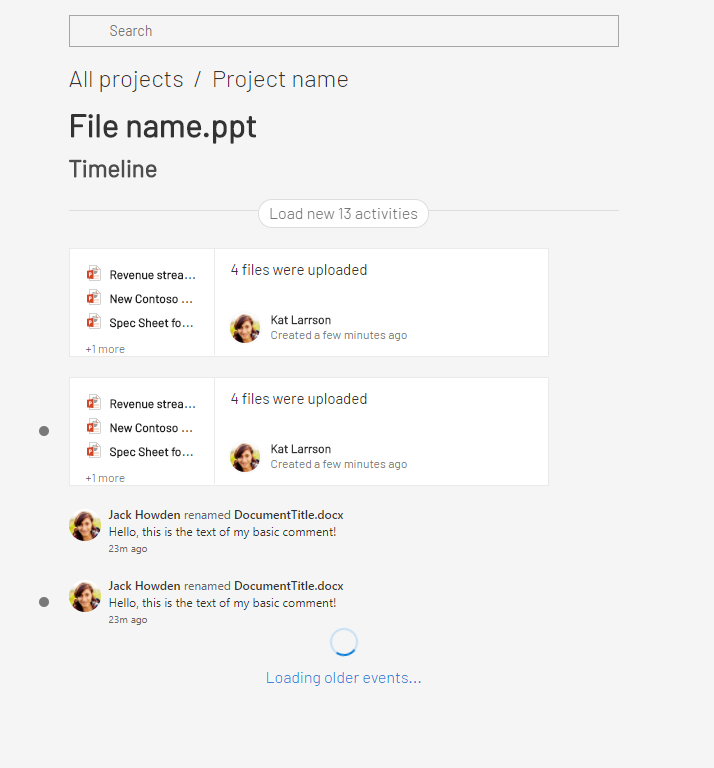

# Timeline pre-employment test

## Task

Your goal is to implement timeline page using provided components and API

Feel free to use any state-management library.
You can also use javascript instead of typescript.



## Timeline logic

- Every page should show 10 latest activities.
- If user reaches bottom of the page you should display next 10 activities ("infinity scroll" is a preferred way, but you can implement it using "load more" button)
- You should subscribe for global timeline / timeline of opened project / file / user and collect all new activities behind button "load new {} activities"
- After clicking on "load new activities" you should display it, marked all of them with dot (`highlighted` property in `Comment` and `FileIsUploaded` components)
- Flag `highlighted` should be removed after 5 second since it was in visible area
- user can click filename and user name to navigate particular file / user / project

Please, implement as much as you can.

## Installation

```
npm install
npm start
```

## Submitting

```
npm run zip
```

Please, send to us `solution.zip` archive after that.

## API

To see API usage check `src/API/usage`